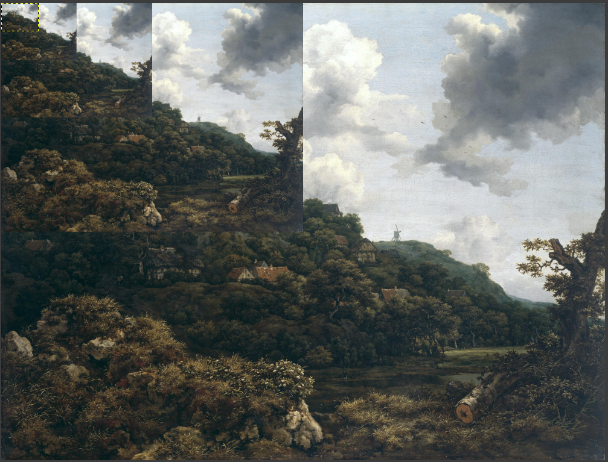

# Performance considerations

## Input 

The performance is greatly improved if you provide your images in more than one resolution. This can be accomplished by providing image pyramids. Using `vips8` you can generate a TIF file pyramid:

```bash
vips tiffsave input.jpg output_pyramid.tif --compression deflate --tile --tile-width 256 --tile-height 256 --pyramid 
```

The same can be achieved in Elixir with [Vix](https://hex.pm/packages/vix):

```elixir
{:ok, file} = Image.new_from_file("input.jpg")

Operation.tiffsave(file, "output_pyramid.tif",
    pyramid: true,
    "tile-height": 256,
    "tile-width": 256,
    tile: true,
    compression: :VIPS_FOREIGN_TIFF_COMPRESSION_DEFLATE
)
```


This will generate a single file that contains multiple pages of decreasing resolution:


The IIIF Image plug will automatically evaluate these pages and select the best matching for the requested scaling operation - thus avoiding to work on the full scale image where possible.

## Output

Some image formats can not be streamed, see the documentation for the `IIIFImagePlug.V3.Options` module.

## Alternatives to this library

The plug aims to implement the "level 2" [compliance](https://iiif.io/api/image/3.0/compliance) for the IIIF image API. 

If you only want to provide "level 0" data (the most basic required for tiled viewers), you can preprocess your input images beforehand and serve them as static assets (without any specialized library necessary at runtime). 

There exist several [resources](https://training.iiif.io/dhsi/day-one/level-0-static.html) on how to do this.

Running `vips`:

```bash
vips dzsave input.jpg preprocessed_out --layout iiif3 --depth onetile --overlap 0 --suffix .jpg
```

This will create a directory "preprocessed_out" that contains a bunch of directories (each corresponding to a possible "region" parameter) and a basic `info.json` file. These can then be served as static assets.

Again, Vix provides the same functionality in Elixir with [Vix.Vips.Operation.dzsave/3](https://hexdocs.pm/vix/Vix.Vips.Operation.html#dzsave/3).