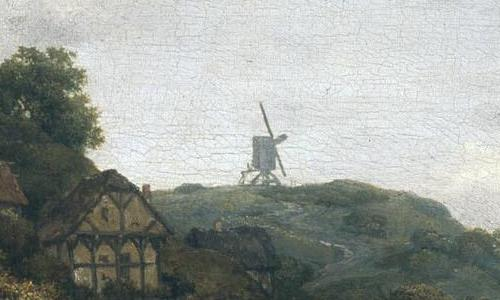

The public domain image `bentheim.jpg` is known as __Jacob van Ruisdael. Gezicht op kasteel Bentheim, circa 1653__ was taken from [wikimedia.org](https://commons.wikimedia.org/wiki/File:Il_castello_di_Bentheim_(Jacob_Van_Ruisdael).jpg).

The smaller `bentheim_mill.jpg` was created based of the full image and is used in tests.

